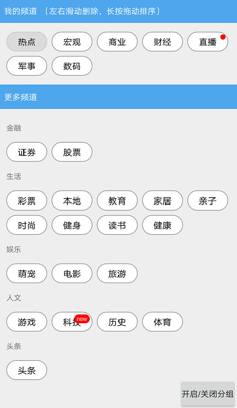

# ChannelTagView

一个频道管理view，可拖拽排序，滑动删除。
----

添加频道分组功能
--

<video id="video" controls="" preload="none" poster="show_category.png">
      <source id="mp4" src="show.mp4" type="video/mp4">
      
Your user agent does not support the HTML5 Video element.

</video>

使用
--
    allprojects {
		repositories {
			...
			maven { url 'https://jitpack.io' }
		}
	}

xml中直接引用：

    <com.zhl.channeltagview.view.ChannelTagView
        android:id="@+id/channel_tag_view"
        android:layout_width="match_parent"
        android:layout_height="match_parent"
        app:fixedPos="0"
        app:channelItemTxSize="@dimen/channel_item_txsize"
        />
 
 
 调用 ChannelTagView的initChannels() 方法填充数据即可。有针对里面的item修改的各种属性，针对点击事件和用户的拖动滑动事件接口监听。详情查看demo
 
