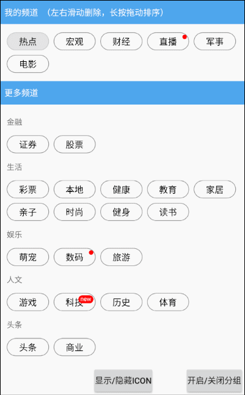

# ChannelTagView

一个频道管理view，可拖拽排序，滑动删除。
----

使用
--
 step1.Add it in your root build.gradle at the end of repositories:
-

    allprojects {
		repositories {
			...
			maven { url 'https://www.jitpack.io' }
		}
	}

stpe2.Add the dependency:
-
    dependencies {
	        compile 'com.github.yilylong:ChannelTagView:v1.0.1'
	}

xml中直接引用：

    <com.zhl.channeltagview.view.ChannelTagView
        android:id="@+id/channel_tag_view"
        android:layout_width="match_parent"
        android:layout_height="match_parent"
        app:fixedPos="0"
        app:channelItemTxSize="@dimen/channel_item_txsize"
        />
 
 
 调用 ChannelTagView的initChannels() 方法填充数据即可。有针对里面的item修改的各种属性，针对点击事件和用户的拖动滑动事件接口监听。
 4.4一下可能需要<uses-permission android:name="android.permission.SYSTEM_ALERT_WINDOW"/>权限，详情查看demo
 
